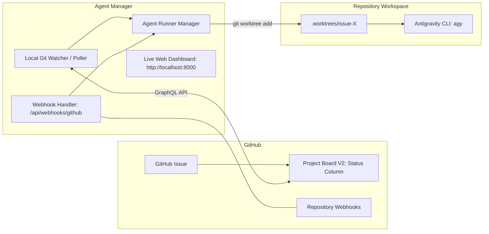

# 🎛️ Agent Manager Integration Guide

This guide explains how to connect any repository using the **Agent-Driven Development Starter Template** to the **Google Antigravity Agent Manager** control plane (`e:\~Michael Bowen\Projects\agent-manager`).

---

## 🌟 Overview

The **Agent Manager** operates as an autonomous control plane that orchestrates Antigravity coding agents. It provides:
1. **Automated Session Dispatching**: Spawns isolated Git worktree sessions (`.worktrees/issue-<number>`) whenever an issue enters `📋 Ready for Agent`.
2. **Project Board Synchronization**: Direct GitHub GraphQL synchronization with Kanban board columns (`📥 Backlog`, `📋 Ready for Agent`, `⚡ In Progress`, `🔍 In Review`, `✅ Done`) without modifying issue tags.
3. **Live Web Dashboard**: Interactive token streaming, tool call inspectors, thinking blocks, and one-click session aborts.
4. **Interactive Context Injection**: Allows injecting feedback or clarifications directly into an active agent's running session.

---

## 🏗️ Architecture



---

## ⚙️ Repository Configuration (`agent-manager.json`)

Each downstream repository defines its interfacing configuration in `agent-manager.json`:

```json
{
  "name": "agent-manager-manifest",
  "version": "1.0.0",
  "manager": {
    "project_board_id": "PVT_kwHOAgkA3s4Blmhh",
    "poll_interval_seconds": 15,
    "default_branch": "master",
    "worktree_root": ".worktrees"
  },
  "columns": {
    "backlog": "📥 Backlog",
    "ready": "📋 Ready for Agent",
    "in_progress": "⚡ In Progress",
    "in_review": "🔍 In Review",
    "done": "✅ Done"
  },
  "guardrails": {
    "max_turns": 15,
    "worktree_isolation": true,
    "board_status_only": true
  }
}
```

---

## 🚀 Setup Methods

### Method 1: Local Project Board Watcher (Zero Tunnel / Out-of-the-Box)

The Agent Manager includes a built-in `LocalGitWatcher` (`agent_manager/poller.py`) that polls your GitHub Project Board via the GitHub GraphQL API.
- **No public webhook tunnel or open ports required.**
- Simply add your GitHub Project Board ID to `.env` in `agent-manager`:
  ```env
  PROJECT_BOARD_IDS=PVT_kwHOAgkA3s4Blmhh,PVT_kwHOAgkA3s4BlnSi
  ```
- When you drag an issue card into **`📋 Ready for Agent`**, Agent Manager will:
  1. Detect the card.
  2. Move it to **`⚡ In Progress`**.
  3. Create `.worktrees/issue-<number>`.
  4. Launch the Antigravity agent CLI.

### Method 2: GitHub Webhooks (Real-Time Push)

If running `agent-manager` on a reachable URL or local tunnel (`ngrok`, `smee.io`):
1. In your repository on GitHub, navigate to **Settings > Webhooks > Add webhook**.
2. **Payload URL**: `http://<your-host>:8000/api/webhooks/github`
3. **Content type**: `application/json`
4. **Secret**: Match `GITHUB_WEBHOOK_SECRET` in `agent-manager/.env`.
5. **Events**:
   - `Issues`
   - `Issue comments`
   - `Projects v2 item`

---

## 🛠️ Automated Repository Registration with `setup.js`

To automatically provision labels and register your repository's webhook in one step:

```bash
# Provision workflow labels:
node setup.js <owner/repo> <github-token>

# Provision labels AND configure Agent Manager webhook:
node setup.js <owner/repo> <github-token> --manager-url http://localhost:8000/api/webhooks/github --secret mysecret
```

---

## 📋 Operational Guidelines for Agents Interfacing with Agent Manager
1. **Never Touch Issue Labels**: Status changes are handled via Project Board columns or the Agent Manager poller.
2. **Respect Worktrees**: All development must remain scoped to `.worktrees/issue-<number>`.
3. **Budget Guardrail**: Pauses at 15 turns if human approval or scope clarification is required.
