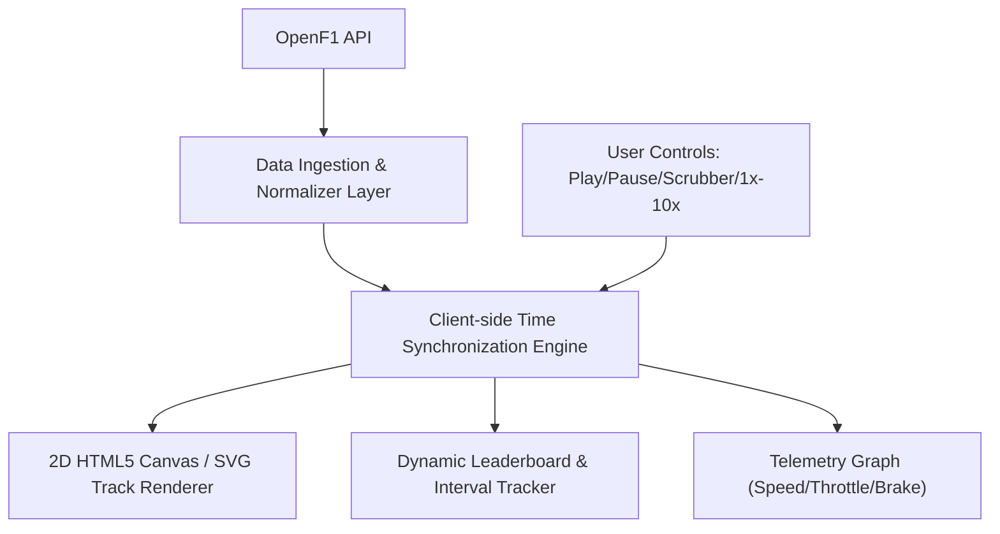

# 🏎️ Architecture & Scope: Historical Race Replay & Virtual Track Simulation

**Author**: Antigravity Autonomous Agent  
**Related Issue**: [#2](https://github.com/BowenMichael/f1-frontend/issues/2)  
**Target Milestone**: F1 Viewer v2.0  

---

## 1. Executive Summary

This document specifies the technical architecture and scope of work required to build a **Historical Race Explorer** and **Interactive 2D Virtual Track Replay Simulation** using the public [OpenF1 API](https://openf1.org/).

### User Workflow
1. **Search & Filter**: Users can browse historical Formula 1 seasons (e.g., 2023, 2024), search by Grand Prix circuit or country, and select an event.
2. **Session Selection**: Displays all sessions for that Grand Prix weekend (Practice 1/2/3, Qualifying, Sprint, Grand Prix).
3. **Simulation Replay Engine**: An interactive 2D canvas view with a glowing circuit silhouette, showing real-time car trackers (color-coded dots with driver numbers and acronyms) moving along the track in sync with a timeline scrubber, accompanied by a dynamic live timing leaderboard and driver telemetry graphs.

---

## 2. OpenF1 Data Pipeline & Endpoint Mapping

| Feature | OpenF1 Endpoint | Key Parameters | Data Returned |
| :--- | :--- | :--- | :--- |
| **Race Calendar** | `/meetings` | `year=2023` | `meeting_key`, `meeting_name`, `circuit_short_name`, `country_name`, `date_start` |
| **Weekend Sessions**| `/sessions` | `meeting_key=1219` | `session_key`, `session_name` (FP1, Sprint, Race), `date_start` |
| **Driver Grid** | `/drivers` | `session_key=9158` | `driver_number`, `name_acronym`, `team_colour`, `team_name`, `headshot_url` |
| **Track Coordinates**| `/location` | `session_key=9158` | `date` (ISO timestamp), `driver_number`, `x`, `y`, `z` (relative track coordinates) |
| **Car Telemetry** | `/car_data` | `session_key=9158` | `speed`, `rpm`, `gear`, `throttle`, `brake`, `drs`, `date` |
| **Lap Times & Gaps**| `/laps`, `/intervals` | `session_key=9158` | `lap_number`, `lap_duration`, `gap_to_leader`, `interval` |

---

## 3. Core Technical Architecture



### A. Coordinate Normalization & Track Mapping
- OpenF1's `/location` endpoint provides raw `(x, y)` coordinate integers representing the car's position in track space.
- **Normalization Algorithm**:
  1. Determine bounding box: `min_x`, `max_x`, `min_y`, `max_y` for the circuit.
  2. Scale to canvas dimensions with aspect ratio preservation:
     ```typescript
     const scale = Math.min(canvasWidth / (maxX - minX), canvasHeight / (maxY - minY));
     const screenX = (rawX - minX) * scale + padding;
     const screenY = (rawY - minY) * scale + padding;
     ```
  3. Draw track path by computing the convex/concave hull or path spline from the first clean lap of the race leader.

### B. High-Performance Interpolation Engine (60 FPS)
- Since OpenF1 location packets are sampled at ~3-4 Hz, the client-side replay engine uses **linear and cubic Hermite spline interpolation** between timestamps `t0` and `t1` based on the virtual clock:
  ```typescript
  const progress = (virtualClock - t0) / (t1 - t0);
  const currentX = x0 + (x1 - x0) * progress;
  const currentY = y0 + (y1 - y0) * progress;
  ```
- This ensures fluid, cinematic 60 FPS car movement across the circuit map.

### C. Playback Scrubber & Speed Multipliers
- **Controls**: Play, Pause, Jump to Lap, 1x (Realtime), 2x, 5x, 10x speeds.
- **Lap Markers**: Visual tick marks on the progress bar indicating safety cars, pit windows, and race incidents.

---

## 4. Visual Design & Aesthetic Mockups

### Mockup 1: Virtual Track Replay & Simulation Dashboard

- **Central Neon Circuit Map**: Minimalist glowing track path with directional color-coded driver dots (e.g., `#1` Verstappen in Red Bull Navy, `#44` Hamilton in Mercedes Teal, `#16` Leclerc in Ferrari Red).
- **Live Leaderboard (Left)**: Live positions, interval gaps, team color accents, and tyre compound badges (`(S)`, `(M)`, `(H)`).
- **Playback Controls & Telemetry (Bottom)**: Scrubber bar, speed multipliers, throttle/brake input graphs, and driver focus selector.

### Mockup 2: Historical Race Explorer & Session Selector

- **Filter Bar**: Season/Year tabs (2023, 2022, etc.), Circuit search, and Grand Prix name filter.
- **Grand Prix Cards Grid**: Circuit track silhouettes, country flags, date ranges, and interactive session pills (`FP1`, `Qualifying`, `Sprint`, `Grand Prix`) with an *“Open Simulation”* action button.

---

## 5. Scope of Work & Phased Implementation Plan

### Phase 1: Historical Meetings & Session Selector *(Sprint 1)*
- [ ] Add `GETMeetings(year)` and `GETSessions(meetingKey)` in `lib/middleware/index.ts`.
- [ ] Build `RaceExplorer` page with season filter and circuit search.
- [ ] Create interactive Grand Prix cards with session launcher buttons.

### Phase 2: Location & Telemetry Ingestion Layer *(Sprint 2)*
- [ ] Add `GETLocation(sessionKey, driverNumber)` and `GETCarData(sessionKey, driverNumber)`.
- [ ] Implement client-side coordinate cache & indexed DB store to avoid re-fetching high-volume location samples.
- [ ] Build timestamp synchronization clock with 1x, 2x, 5x, 10x multiplier support.

### Phase 3: 2D Canvas Track Renderer & Car Tracker *(Sprint 3)*
- [ ] Build `CircuitCanvas` component utilizing HTML5 Canvas or SVG paths.
- [ ] Implement coordinate normalization and spline smoothing.
- [ ] Render color-coded driver dots with acronyms and directional indicators.

### Phase 4: Dynamic Leaderboard & Scrubber Bar *(Sprint 4)*
- [ ] Build `ReplayControls` component with timeline slider and lap jump.
- [ ] Integrate real-time leaderboard sorting based on virtual track distance.
- [ ] Add driver telemetry graph overlay (Speed, Gear, Throttle, Brake).
